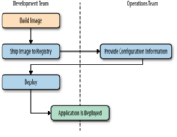

# Docker Slogans

Every company aside having a mission and a vision statement might have some slogans that are required to deliver a message about their product. Docker has two main slogans:

###1. Build, Ship and Deploy
Docker allows a software to be packaged in a loosely coupled way that enables a software component(s) to be easily deployed without the need for the configuration and installation hustle.

The workflow of the any application ends usually with deployment and here the famous Quote “it worked on my device or it passed all of tests” appears.
An image is a deployment component that has all the needed code, libraries, frameworks and filesystems.
Abstracting the solution into an image packed with all of its dependences allows the removal of a deployment hell caused by environment conflicts and changes. 	 

###2. Batteries included but replaceable 
Docker insures a concept well established in the world of Object Oriented Development which allows a component to be replaced with another one by just implementing the main interface used by the top layer.

