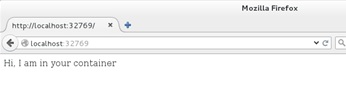

# Docker Build

This is the recommended way to create a docker image.

###Demo
**Step 1:** Create directory

```$ mkdir NginxDir```

**Step 2:** Create file

```$ vi Dockerfile```

**Step 3:** Write this commands in the file

# Version: 0.0.1
FROM ubuntu
MAINTAINER Walid Ashraf "w@w.com"
RUN apt-get install -y nginx
RUN echo 'Hi, I am in your container' \
>/usr/share/nginx/html/index.html
EXPOSE 80


**Step4:** Build Image

```$ sudo docker build -t="walid/ngtest" .```

…Successfully built d69edbcc0346

**Step 5:** Check the Image

```$ sudo docker images "walid/ngtest" .```

    REPOSITORY          TAG                 IMAGE ID            CREATED             VIRTUAL SIZE
    washraf/ngtest      latest              d69edbcc0346        2 minutes ago       206.5 MB
**Step 6: ** Run the container will the webserver

```sudo docker run -d -p 80  washraf/ngtest nginx -g "daemon off;"```

**Step 7:** check the assigned port from the docker deamon

```$ sudo docker ps```	

    CONTAINER ID        IMAGE               COMMAND                  CREATED             STATUS              PORTS                   NAMES
    6d575aeb39f1        washraf/ngtest      "nginx -g 'daemon off"   2 minutes ago       Up 2 minutes        0.0.0.0:32769->80/tcp   drunk_babbage
**Step 8:** visit the site



>For more about building docker images check the See Docker File part and the [build command page](https://docs.docker.com/reference/commandline/build/)