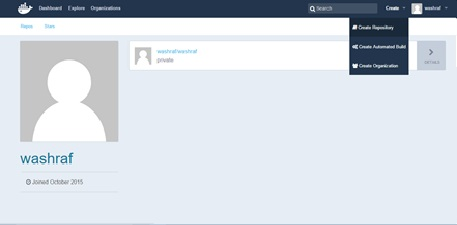
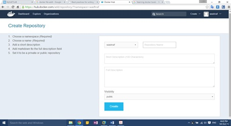

# Push Image to Docker HUB

###Create a Repository
Login to your account and click the create button and choose to create Repository.



Fill the following form with the repository name, description and visibility.


 
>Note that the name of the repo is always addressed with the name space e.g. washraf/repo this is used to differentiate the original images created by the docker team from the images created by normal users.

###Login to you account on engine
Using the login command you must supply your username, password and mail to configure your docker daemon with your account.

    $sudo docker login
    Username: blabla
    Password:
    Email blabla@mail.com

###Push an Image
```$sudo docker push walid/test```

Make sure that you have a repo by this name or do this command: 

```sudo docker tag walid/nginx username/reponame```