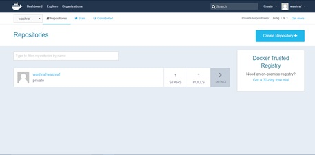

# Using Docker HUB

Docker hub is the host of the version control and host for all the public and private owned images for both personal and enterprise usage.

Visit the [signup page](https://hub.docker.com/account/signup) and create an account using you username and password.
After verifying your account login to your account and visit the page.

